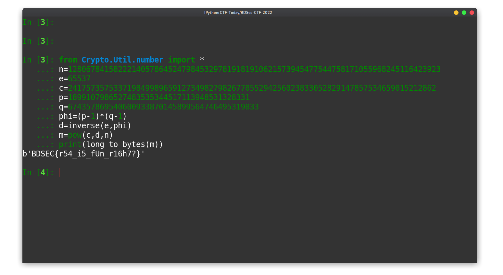

```py
from Crypto.Util.number import *
n=1280678415822214057864524798453297819181910621573945477544758171055968245116423923
e=65537
c=241757357533719849989659127349827982677055294256023833052829147857534659015212862
p=1899107986527483535344517113948531328331
q=674357869540600933870145899564746495319033
phi=(p-1)*(q-1)
d=inverse(e,phi)
m=pow(c,d,n)
print(long_to_bytes(m))
```

